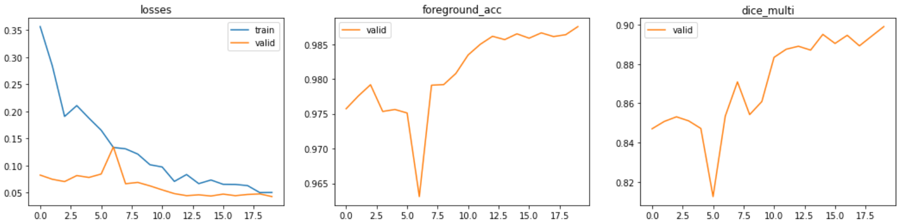

## About
There are two parts in training the notebook:
- minimal training is to run a down-sized pic version to 64x64 resolution
- big training, gradually upscaling while training on top of each model
There are total of 4 notebooks in this project:

| Notebook | Description |
|-----|-----|
|[SegmentationLearner](SegmentationLearner.ipynb)|Train initial low-res model |
|[GoBig](GoBig.ipynb)| Scale up the model |
|[ONNX](ONNX.ipynb)| ONNX inference. Load model, predict |
|[RealImagePred](RealImagePred.ipynb)| Attempt to predict real life images |


## Initial train
Initial training is done in the notebook [SegmentationLearner](SegmentationLearner.ipynb). Main parts there are:
 - Data loading
 - Data debugging
 - Training
 - Saving 
 - Metrics
 - Predicting

Things to notice in this part of training:
- Be sure to check ```batch_tmfs``` before training. There are transform parameters to apply on each batch, most of which are augmentations. This extends the dataset a also making the model more resistant to image imperfections and better generalized. However it makes model train longer, so keep in mind when dealing with larger datasets.
- Normalize() transform does what is says - normalizes through batch before passing it to train. It doesn't seem to increase metrics while training, but at inference point ONNX seems to like it better.
- You can use transfer learning to train on top of resnet's pre-trained weights. However, seeing as the scene in Unity is likely not realistic enough my advice is not to use it. If you setup a more realistic scene, you're welcome to try it out and share the results.
- If you have problems with generated labels, try debuging them in the Debug section. Use ```debug_label(lnames[0], 1)``` to display a filtered label, to see if they are saved as expected.
- Models are saved in three variants. Comment if you don't need them all. I.e. if you are not doing testing with low res, you can skip saving via ```to_onnx```. Export 

You can preview the notebook without downloading here in github. If they are not loading from first try, try reloading multiple times. Eventually it should load properly.

Models are saved in /Assets/Data~/models/ folder in the project.


## Upscaling
Upscaling is done by loading the saved x64 size model and training on larger Resize() values. Open [GoBig](GoBig.ipynb) notebook to see code.
This saves a resources and delivers adequate results.


We can see in this last graph that in the begining the lines seem to jump up and down sporadically but after a while they smooth up. Since we use a sliced LR though the range, this means that starting learning rate is too high, while ending seems quite OK. Let's see how it looks after reducing starting LR  10 times:

Much better! The start descent is much faster now. There are still a couple jumps and falls, which could be due to randomness, or perhaps we need to reduce the ending LR too. Let's train on even larger resolution next:

And then even higher up to even *512 x 512*:




## Common weird errors
Some of the errors are not too intuitive, though if you worked with DNNs before, you have likely seen them.
- CUDA out of memory error. This little devil haunts day and night. It is what is says, so no trickery there, but just to discuss a few hints concerning this project.
  - Stop all other notebooks. Torch will reserve GPU memory regardles if you are using at the time as long as the kernel is running. So click ```Kernel > Shutdown All Kernels``` to clear it up. Be sure to save the models you have trained fist! Otherwise you might lose valuable data.
  - Monitor memory via running ```watch -n 0.5 nvidia-smi``` in terminal. I.e. while training an upscaled model (x256) it gives me:
  

|  GPU |  GI ID| CI ID| PID | Type | Process name | GPU Memory Usage |
| ----------- | ----------- | ----------- | ----------- | ----------- | ----------- | ----------- |
|    0 |  N/A | N/A   |   1209    |  G |  /usr/lib/xorg/Xorg     |           198MiB |
|    0  | N/A | N/A   |   2183 |     G |  /usr/lib/xorg/Xorg   |             624MiB |
|    0  | N/A | N/A   |   2311 |     G |   /usr/bin/gnome-shell    |           90MiB |
|    0  | N/A | N/A   |   4043 |     G |  ...AAAAAAAAA= --shared-files    |  155MiB |
|    0 |  N/A | N/A   |   8767 |     G |  ...AAAAAAAAA= --shared-files   |    51MiB |
|    0 | N/A | N/A   |   9475 |     G |  ...r/2021.1.5f1/Editor/Unity   |   329MiB |
|    0  | N/A | N/A   |  11274  |    C |  ...ssB/classB_env/bin/python   |  9599MiB |

As you can see almost all of the memory (of available 11 Gig) is consumed. Closing some applications might be a solution, i.e. fastAPI server, because it loads a onnx session which in turn eats up some and Unity.
- A weird one ```RuntimeError: CUDA error: device-side assert triggered``` which does not really say anything useful. In the case of this project, I've noticed that this error triggers when the model receives a different amount of ```n_classes``` than it has ```out```s. This can happen, i.e. if camera in Unity sees an undefined label color and saves it. To solve this all of "undefined" objects in the level should be of color black, in other words - label color ```0```. If you get this error, try debuging what color codes you get in the label picture. There are helper functions (like ```n_codes``` and ```mask_check```) for that in "Debuging loaded label images" chapter in ```SegmentationLearner.ipynb``` notebook.